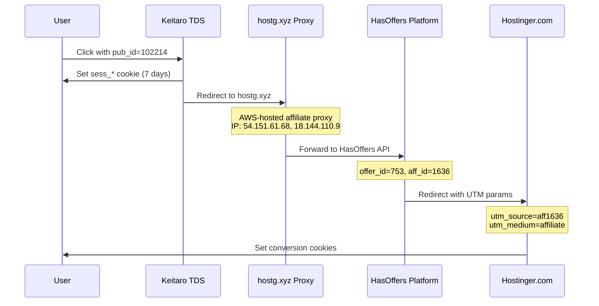

# Affiliate Tracking Flow

## Summary

This flow documents the affiliate tracking pipeline from click to final destination. This document captures **VERIFIED HTTP-level behavior** only. Commission rates, attribution windows, and internal processing are UNKNOWN.

---

## Flow Diagram (Verified HTTP Behavior)



---

## VERIFIED Tracking Parameters

### Keitaro TDS Parameters

| Parameter | Direction | Description | Example | Verification |
|-----------|-----------|-------------|---------|--------------|
| `campaign_id` | Input | Campaign identifier | `10115` | ✅ Verified |
| `pub_id` | Input | Publisher identifier | `102214` | ✅ Verified |
| `aff_sub` | Output | Passed to affiliate network | `102214` | ✅ Verified |
| `aff_sub2` | Output | Click ID hash | `69c2d859284c...` | ✅ Verified |

### HasOffers Parameters

| Parameter | Direction | Description | Example | Verification |
|-----------|-----------|-------------|---------|--------------|
| `offer_id` | Output | Offer identifier | `753` | ✅ Verified |
| `aff_id` | Output | Affiliate account | `1636` | ✅ Verified |
| `aff_sub` | Input | Publisher reference | `102214` | ✅ Verified |
| `aff_sub2` | Input | Click tracking hash | `69c2d859284c...` | ✅ Verified |

### Hostinger UTM Parameters

| Parameter | Value | Purpose | Verification |
|-----------|-------|---------|--------------|
| `utm_source` | `aff1636` | Affiliate tracking | ✅ Verified |
| `utm_medium` | `affiliate` | Traffic source type | ✅ Verified |

---

## VERIFIED Cookie Lifecycle

### Keitaro Session Cookie

```
Name: sess_64566fa148714a3a0f517fbe
Value: 6458f31b90598127b526a074
Domain: trakr.yljary.com
Path: /
Expires: 7 days
HttpOnly: Yes
Secure: No (vulnerability)
```

**Verification:** ✅ Captured from HTTP response

### HasOffers Session Cookie

```
Name: hasoffers_session
Domain: hostinger.com
Path: /
Expires: 60 days
Secure: Yes
```

**Verification:** ✅ Captured from HTTP response

### Device Fingerprint

```
Name: ho_mob
Value: {"mobile_device_model":"iPhone","mobile_device_brand":"Apple"}
Domain: hostinger.com
Path: /
Expires: 3 years
```

**Verification:** ✅ Captured from HTTP response

---

## VERIFIED Affiliate Network Integration

### Primary: HasOffers (Tune)

```
Endpoint: hostinger-elb.go2cloud.org
Type: HasOffers Enterprise
Owner: Hostinger

API Endpoints:
- /aff_c - Click tracking (verified)
```

### Proxy Layer (hostg.xyz)

```
Purpose: Masks real affiliate account
Hosting: AWS (54.151.61.68, 18.144.110.9)
SSL: Amazon RSA 2048 M04

Behavior:
- Receives traffic from TDS
- Adds affiliate tracking parameters
- Proxies to HasOffers platform
- Returns Hostinger redirect
```

**Verification:** ✅ Redirect chain tested

### Affiliate Accounts (Verified)

| Account ID | Platform | Source | Verification |
|------------|----------|--------|--------------|
| 1636 | hostg.xyz | Primary | ✅ Active redirecting |
| 151905 | hostinder.com | Typosquat | ✅ Active redirecting |
| 1REQUIREFOR51 | Hostinger | Referral code | ✅ Active on do4g.com |

---

## VERIFIED Redirect Chain

```
1. trakr.yljary.com/click.php?campaign_id=10115&pub_id=102214
   ↓ HTTP 302
2. hostg.xyz/aff_c?offer_id=753&aff_id=1636&aff_sub=102214&aff_sub2=[HASH]
   ↓ HTTP 302
3. hostinger.com (with affiliate tracking)
```

**Verification:** ✅ Tested and confirmed 2026-03-24

---

## UNKNOWN / NOT VERIFIED

| Aspect | Status | Notes |
|--------|--------|-------|
| Commission rates | UNKNOWN | No financial data |
| Attribution windows | UNKNOWN | Only cookie TTLs observed |
| Postback mechanism | UNKNOWN | Never tested |
| Conversion tracking | UNKNOWN | Never observed |
| Revenue flow | UNKNOWN | No financial data accessed |
| Fraud detection logic | UNKNOWN | HasOffers internal |

---

*This document contains only VERIFIED observations.*
