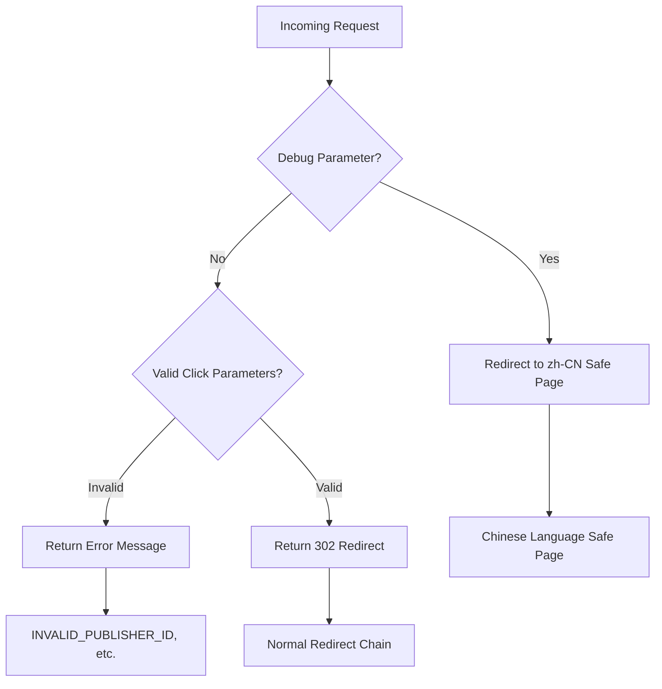

# Bot Detection Flow - Cloaker Behavior

## Summary

This flow documents the observed bot detection and cloaking behaviors of the yljary.com Keitaro TDS. This document captures **VERIFIED HTTP-level behavior** only. The detection algorithm and internal logic are UNKNOWN.

---

## Flow Diagram (Verified Outcomes)



---

## VERIFIED Detection Outcomes

### Debug Parameter Detection

| Parameter | Redirect Target | Verification |
|-----------|-----------------|--------------|
| `debug=1` | zh-CN safe page | ✅ Tested |
| `test=1` | zh-CN safe page | ✅ Tested |
| `dev=1` | zh-CN safe page | ✅ Tested |
| `admin=1` | zh-CN safe page | ✅ Tested |
| `debug=anything` | zh-CN safe page | ✅ Tested |

### Response Comparison

| Trigger | Response | Verification |
|---------|----------|--------------|
| Normal request with valid params | 302 redirect to affiliate | ✅ Tested |
| Normal request with invalid params | Error message (200 OK) | ✅ Tested |
| Request with debug param | 302 to zh-CN page | ✅ Tested |

---

## VERIFIED Safe Page Behavior

### zh-CN Safe Page (Debug Parameter Trigger)

When `debug=1` or similar parameter is present:

```
HTTP/2 302
location: https://[domain]/zh-CN/[path]
```

**Verification:** ✅ Tested with multiple debug parameters

### Endpoint Masking Behavior

| Endpoint | Response | Verification |
|----------|----------|--------------|
| `/` | Empty 200 OK | ✅ Tested |
| `/admin` | Empty 200 OK | ✅ Tested |
| `/.env` | Empty 200 OK | ✅ Tested |
| `/unknown-path` | Empty 200 OK | ✅ Tested |
| `/click` (no params) | Empty 200 OK | ✅ Tested |

**Pattern:** All unknown paths return 200 OK with empty body - this is cloaker masking behavior to hide the system's presence.

---

## VERIFIED Device Fingerprint Cookie

### ho_mob Cookie Structure

```json
{
    "mobile_device_model": "iPhone",
    "mobile_device_brand": "Apple"
}
```

| Attribute | Value | Verification |
|-----------|-------|--------------|
| Domain | hostinger.com | ✅ Captured |
| TTL | 3 years | ✅ Captured |
| Purpose | Device fingerprinting | ⚠️ Inferred from name |

---

## UNKNOWN / NOT VERIFIED

| Aspect | Status | Notes |
|--------|--------|-------|
| Detection algorithm | UNKNOWN | Proprietary to Keitaro |
| User-Agent patterns used | UNKNOWN | Only outcomes observed |
| IP reputation checks | UNKNOWN | Never tested |
| JS capability checks | UNKNOWN | Never tested |
| Behavioral analysis | UNKNOWN | Never tested |
| Cloudflare WAF rules | UNKNOWN | WAF dashboard needed |

---

## What Is Actually Known

| Finding | Evidence | Verification |
|---------|----------|--------------|
| Debug params trigger safe page | Direct testing | ✅ Verified |
| Unknown paths return empty 200 | Endpoint enumeration | ✅ Verified |
| ho_mob cookie exists | HTTP response headers | ✅ Verified |
| Cloaker masking behavior | Endpoint testing | ✅ Verified |

---

*This document contains only VERIFIED observations.*
