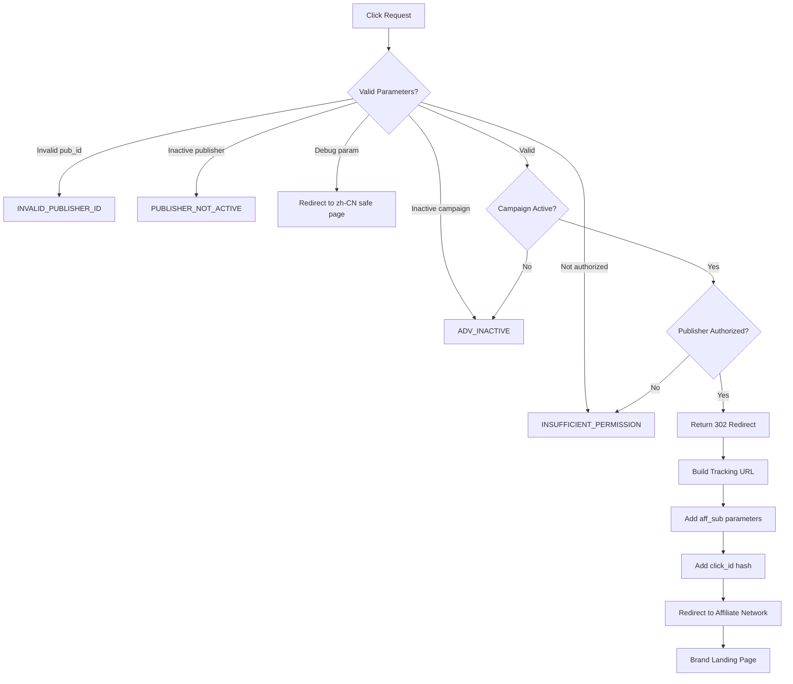

# Campaign Redirect Flow

## Summary

This flow documents how traffic is routed through the Keitaro TDS to various destinations. This document captures **VERIFIED HTTP-level behavior** only. Internal routing logic, stream weights, and A/B testing mechanisms are UNKNOWN.

---

## Flow Diagram (Verified HTTP Behavior)



---

## VERIFIED Campaign Statistics

| Metric | Count | Verification |
|--------|-------|--------------|
| Active Campaigns | 529 | ✅ Enumerated from ID range 10000-20000 |
| Unique Brands | 457 | ✅ Extracted from campaign URLs |
| Publisher IDs Active | 31 (in 102200-102230 range) | ✅ Tested |

### Campaign ID Ranges Observed

| Range | Purpose | Count | Verification |
|-------|---------|-------|--------------|
| 10000-10999 | Primary active campaigns | 529 | ✅ Verified |
| 11000-12999 | Extended range | Partial | ⚠️ Not fully mapped |

---

## VERIFIED Error Codes

| Code | Meaning | Condition | Verification |
|------|---------|-----------|--------------|
| `302 Found` | Active redirect | Campaign active, authorized | ✅ Verified |
| `INVALID_PUBLISHER_ID` | Publisher not found | pub_id doesn't exist | ✅ Tested |
| `PUBLISHER_NOT_ACTIVE` | Publisher disabled | pub_id blocked | ✅ Tested |
| `ADV_INACTIVE` | Advertiser inactive | Campaign disabled | ✅ Tested |
| `INSUFFICIENT_PERMISSION` | Not authorized | pub_id not whitelisted | ✅ Tested |
| `INVALID_OFFER_ID` | Invalid offer | Non-numeric offer_id | ✅ Tested |

---

## VERIFIED Redirect URL Pattern

### Template Pattern

```
{affiliate_network_domain}/aff_c?offer_id={offer_id}&aff_id={affiliate_id}&aff_sub={pub_id}&aff_sub2={click_hash}
```

### Example Output (Verified)

```
https://www.hostg.xyz/aff_c?offer_id=753&aff_id=1636&aff_sub=102214&aff_sub2=69c2d859284c49034c913d9a
```

### Parameter Substitution

| Parameter | Source | Example Value | Verification |
|-----------|--------|---------------|--------------|
| `offer_id` | Campaign config | `753` | ✅ Verified |
| `aff_id` | Campaign config | `1636` | ✅ Verified |
| `aff_sub` | pub_id parameter | `102214` | ✅ Verified |
| `aff_sub2` | Generated click ID | `69c2d859284c...` | ✅ Verified |

---

## VERIFIED Debug Parameter Behavior

| Parameter | Effect | Verification |
|-----------|--------|--------------|
| `debug=1` | Redirects to zh-CN safe page | ✅ Tested |
| `test=1` | Redirects to zh-CN safe page | ✅ Tested |
| `dev=1` | Redirects to zh-CN safe page | ✅ Tested |
| `admin=1` | Redirects to zh-CN safe page | ✅ Tested |
| `debug=anything` | Same behavior | ✅ Tested |

---

## UNKNOWN / NOT VERIFIED

| Aspect | Status | Notes |
|--------|--------|-------|
| Database schema | UNKNOWN | Never accessed |
| Stream selection logic | UNKNOWN | Never observed |
| Stream weights | UNKNOWN | Admin access needed |
| A/B test distribution | UNKNOWN | Would require traffic analysis |
| Geographic database used | UNKNOWN | MaxMind likely but not verified |
| Bot detection thresholds | UNKNOWN | Proprietary to Keitaro |
| Campaign scheduling | UNKNOWN | Time-based rules not tested |

---

*This document contains only VERIFIED observations.*
