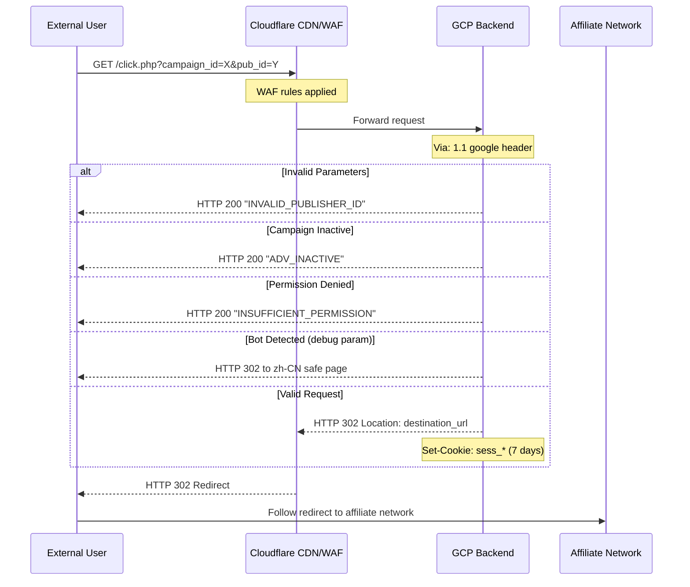

# Click Flow - Primary Traffic Entry Point

## Summary

The click flow is the primary entry point for all traffic entering the yljary.com Keitaro TDS. This document captures **VERIFIED HTTP-level behavior** only. Internal system architecture (database, caching, queues) is UNKNOWN and not documented here.

---

## Flow Diagram (Verified HTTP Behavior)



---

## VERIFIED OBSERVATIONS

### Trigger

| Attribute | Value | Verification |
|-----------|-------|--------------|
| **Type** | HTTP GET Request | ✅ Tested |
| **Path** | `/click.php` or `/click` | ✅ Tested |
| **Host** | `trakr.yljary.com` or `click.yljary.com` | ✅ Tested |

### Required Parameters

| Parameter | Type | Description | Verification |
|-----------|------|-------------|--------------|
| `campaign_id` | integer | Campaign identifier (e.g., 10115) | ✅ Tested |
| `pub_id` | integer | Publisher identifier (e.g., 102214) | ✅ Tested |

### Optional Parameters

| Parameter | Type | Description | Verification |
|-----------|------|-------------|--------------|
| `debug` | any | Triggers redirect to zh-CN safe page | ✅ Tested |
| `source` | string | Traffic source identifier | ⚠️ Observed in URLs |

---

## VERIFIED HTTP Responses

### Success Response

```
HTTP/2 302
server: cloudflare
via: 1.1 google
x-rt: 13
location: https://www.hostg.xyz/aff_c?offer_id=753&aff_id=1636&aff_sub=102214&aff_sub2=[HASH]
referrer-policy: no-referrer
cf-cache-status: DYNAMIC
set-cookie: sess_[id]=[value]; expires=[7 days]; path=/
```

### Error Responses

| Status | Body Content | Condition | Verification |
|--------|-------------|-----------|--------------|
| HTTP 200 | `INVALID_PUBLISHER_ID` | pub_id not found | ✅ Tested |
| HTTP 200 | `PUBLISHER_NOT_ACTIVE` | pub_id disabled | ✅ Tested |
| HTTP 200 | `ADV_INACTIVE` | Campaign disabled | ✅ Tested |
| HTTP 200 | `INSUFFICIENT_PERMISSION` | pub_id not authorized | ✅ Tested |
| HTTP 200 | `INVALID_OFFER_ID` | Invalid offer_id | ✅ Tested |
| HTTP 302 | zh-CN page | debug=1 parameter | ✅ Tested |

---

## VERIFIED Session Tracking

### Cookies Set

| Cookie | Domain | TTL | Purpose | Verification |
|--------|--------|-----|---------|--------------|
| `sess_{id}` | trakr.yljary.com | 7 days | Session ID | ✅ Captured |
| `ho_mob` | hostinger.com | 3 years | Device fingerprint | ✅ Captured |
| `enc_aff_session_{id}` | hostinger.com | 30 days | Encrypted affiliate session | ✅ Captured |

---

## VERIFIED Redirect Chain

```
Request: https://trakr.yljary.com/click.php?campaign_id=10115&pub_id=102214

Step 1: HTTP 302
Location: https://www.hostg.xyz/aff_c?offer_id=753&aff_id=1636&aff_sub=102214&aff_sub2=[HASH]

Step 2: HTTP 302
Location: https://www.hostinger.com/geo?utm_medium=affiliate&utm_source=aff1636

Final: Hostinger landing page
```

**Verification:** ✅ Tested and confirmed 2026-03-24

---

## UNKNOWN / NOT VERIFIED

The following aspects are **UNKNOWN** and should not be treated as fact:

| Aspect | Status | Notes |
|--------|--------|-------|
| Database schema | UNKNOWN | Never accessed |
| Caching mechanism | UNKNOWN | Could be files, Redis, or database |
| Click ID generation algorithm | UNKNOWN | 24-char hex string observed |
| Bot detection implementation | UNKNOWN | Only outcomes observed |
| Message queue type | UNKNOWN | No evidence of async processing |

---

*This document contains only VERIFIED HTTP-level observations.*
