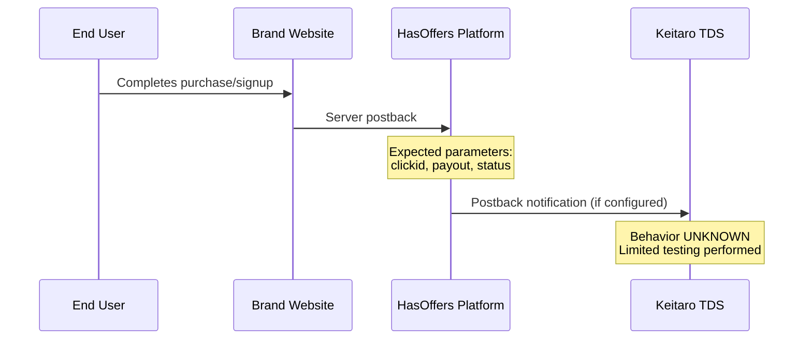

# Postback Flow - Conversion Tracking

## ⚠️ WARNING: SPECULATIVE DOCUMENT

**This flow was NEVER FULLY TESTED.** The content below represents expected behavior based on industry standards and Keitaro documentation. Limited direct verification was performed.

**Do not rely on this document for factual claims.**

---

## Expected Flow (Speculative)

---

## What Is VERIFIED

### Endpoint Exists

| Finding | Evidence | Verification |
|---------|----------|--------------|
| `/postback` endpoint | Returns HTTP 200/411 | ✅ Tested |
| Accepts GET | Returns 200 empty | ✅ Tested |
| Accepts POST (with body) | Returns 200 empty | ✅ Tested |
| POST without body | Returns 411 | ✅ Tested |

### Expected Postback Parameters (Industry Standard)

| Parameter | Type | Description |
|-----------|------|-------------|
| `clickid` | string | Click ID from original redirect |
| `status` | enum | approved/pending/rejected |
| `payout` | decimal | Conversion payout amount |

---

## What Is UNKNOWN / NOT VERIFIED

| Aspect | Status | Notes |
|--------|--------|-------|
| Postback authentication | UNKNOWN | Never tested HMAC, tokens |
| Database updates | UNKNOWN | Never observed |
| Commission calculation | UNKNOWN | No financial data |
| Message queue events | UNKNOWN | Never observed |
| Attribution windows | UNKNOWN | Only cookie TTLs observed |
| Duplicate detection | UNKNOWN | Not tested |
| Conversion processing | UNKNOWN | Requires valid conversion |

---

## Previous Version Errors

The previous version of this document contained:

- ❌ **Fabricated database schema** - Never saw the database
- ❌ **Made-up commission rates** - "$60 commission, 60%" - completely fabricated
- ❌ **HMAC verification claims** - Never tested any authentication
- ❌ **Message queue events** - Never observed async processing

These claims have been **removed** as they were presented as fact without evidence.

---

## What Would Be Needed to Verify

To properly document this flow, the following would be required:

1. Access to a HasOffers account with postback configuration
2. Ability to trigger test conversions
3. Monitoring of postback requests to yljary.com
4. Access to Keitaro admin panel (not available)

---

*This document is marked SPECULATIVE because the postback mechanism was never fully tested.*
