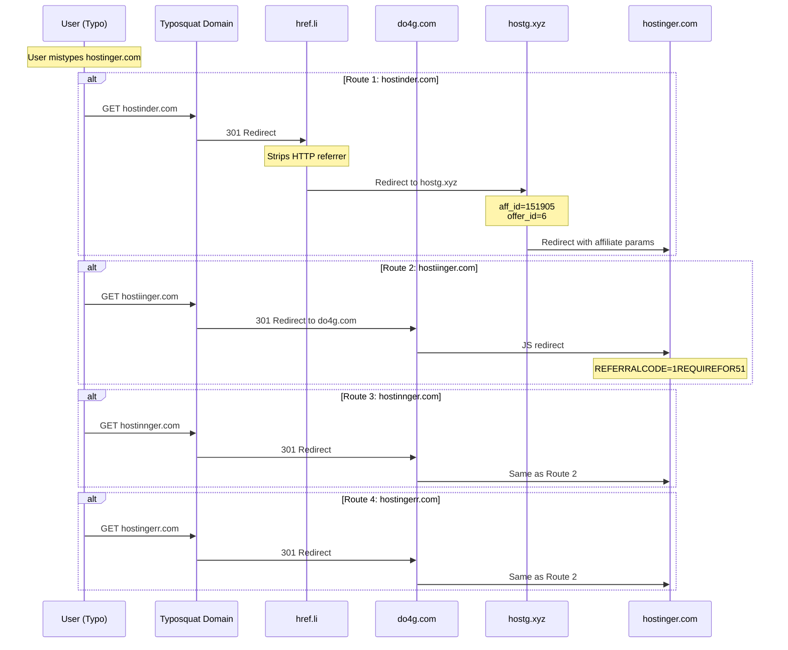

# Typosquat Redirect Flow

## Summary

This flow documents the typosquatting network that captures traffic from misspelled Hostinger domain names. This document captures **VERIFIED redirect chains** only. Operator identity and relationship to main TDS is UNKNOWN.

---

## Flow Diagram (Verified Redirects)



---

## VERIFIED Typosquat Domains

| Domain | Typo Type | IP | Provider | Route | Verification |
|--------|-----------|-----|----------|-------|--------------|
| `hostinder.com` | Letter swap (i↔e) | 104.21.62.252 | Cloudflare | Route 1 | ✅ Tested |
| `hostiinger.com` | Extra 'i' | 104.21.26.30 | Cloudflare | Route 2 | ✅ Tested |
| `hostinnger.com` | Extra 'n' | 172.67.190.66 | Cloudflare | Route 3 | ✅ Tested |
| `hostingerr.com` | Extra 'r' | 104.21.6.174 | Cloudflare | Route 4 | ✅ Tested |

---

## VERIFIED Redirect Chains

### Route 1: hostinder.com → href.li → hostg.xyz → Hostinger

```
Step 1: GET hostinder.com
HTTP/2 301
location: https://href.li?https://www.hostg.xyz/aff_c?offer_id=6&aff_id=151905&source=buildinpublic-der

Step 2: href.li strips referrer (meta refresh)

Step 3: GET www.hostg.xyz/aff_c?offer_id=6&aff_id=151905
HTTP/1.1 302
Location: https://www.hostinger.com/?utm_source=aff151905&utm_medium=affiliate
```

**Verification:** ✅ Tested 2026-03-24

### Route 2-4: hostiinger.com/hostinnger.com/hostingerr.com → do4g.com → Hostinger

```
Step 1: GET hostiinger.com (or hostinnger.com, hostingerr.com)
HTTP/2 301
location: https://do4g.com/ad/sponsor.php?u=https%3A%2F%2Fhostinger.com%3FREFERRALCODE%3D1REQUIREFOR51

Step 2: GET do4g.com/ad/sponsor.php?u=...
HTTP/1.1 200 OK
Content-Type: text/html

(JavaScript redirect to hostinger.com with referral code)
```

**Verification:** ✅ Tested 2026-03-24

---

## VERIFIED Infrastructure

### do4g.com

| Attribute | Value | Verification |
|-----------|-------|--------------|
| IP | 157.245.80.13 | ✅ Verified |
| Provider | DigitalOcean | ✅ Verified |
| Technology | PHP redirect script | ✅ Verified |

### href.li

| Attribute | Value | Verification |
|-----------|-------|--------------|
| Purpose | Anonymize referrer | ✅ Verified |
| Method | Meta refresh redirect | ✅ Verified |

---

## VERIFIED Affiliate vs Referral

| Aspect | Route 1 (Affiliate) | Route 2-4 (Referral) |
|--------|---------------------|---------------------|
| Tracking | HasOffers | Hostinger internal |
| Account | aff_id=151905 | REFERRALCODE=1REQUIREFOR51 |
| Attribution | Affiliate network | Direct to Hostinger |
| Cookie | 60 days (HasOffers) | Unknown |

---

## UNKNOWN / NOT VERIFIED

| Aspect | Status | Notes |
|--------|--------|-------|
| Operator identity | UNKNOWN | No attribution |
| Relationship to main TDS | UNKNOWN | Circumstantial evidence only |
| Total typosquat domains | UNKNOWN | More may exist |
| Traffic volume | UNKNOWN | No analytics access |
| Registration dates | UNKNOWN | WHOIS protected |

---

## Legal/Compliance Issues

### Trademark Infringement

| Domain | Violation Type |
|--------|----------------|
| hostinder.com | Typosquatting Hostinger trademark |
| hostiinger.com | Typosquatting Hostinger trademark |
| hostinnger.com | Typosquatting Hostinger trademark |
| hostingerr.com | Typosquatting Hostinger trademark |

### ICANN/UDRP Exposure

- All domains likely subject to UDRP complaint
- Clear bad faith registration
- Commercial use of trademarked term

---

*This document contains only VERIFIED redirect chains. Operator attribution is UNKNOWN.*
